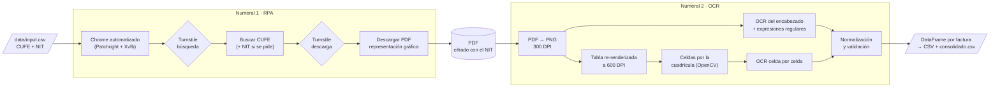
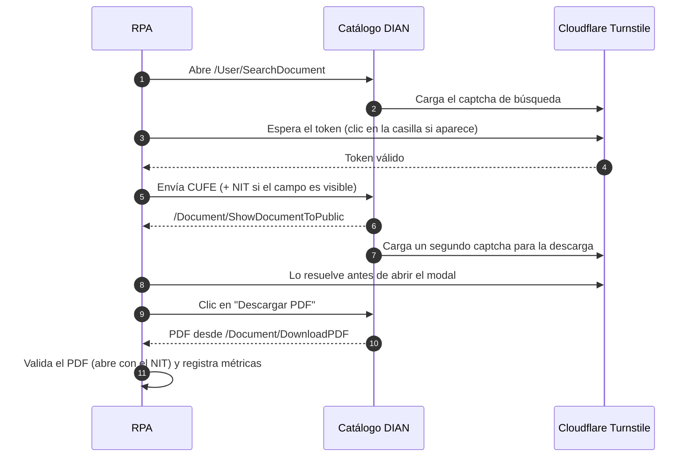
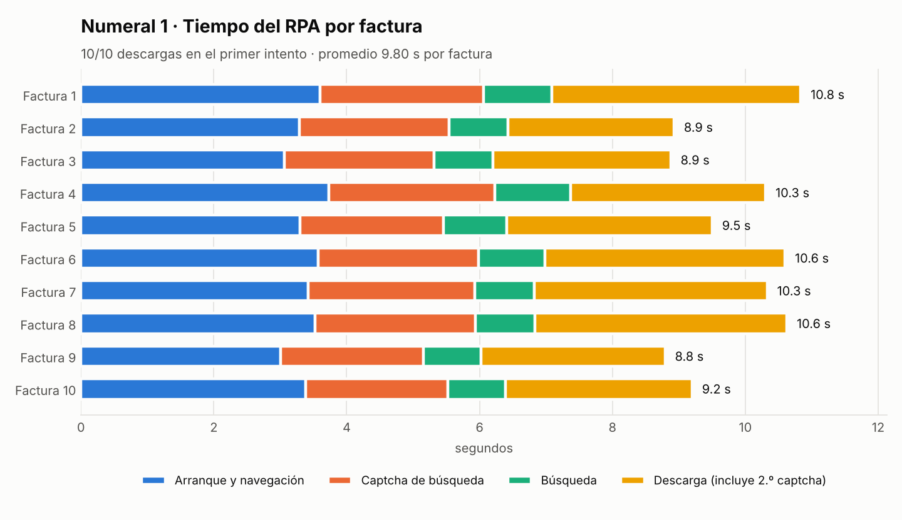
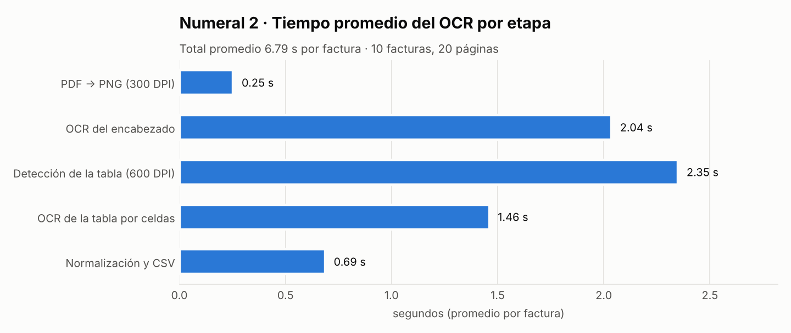
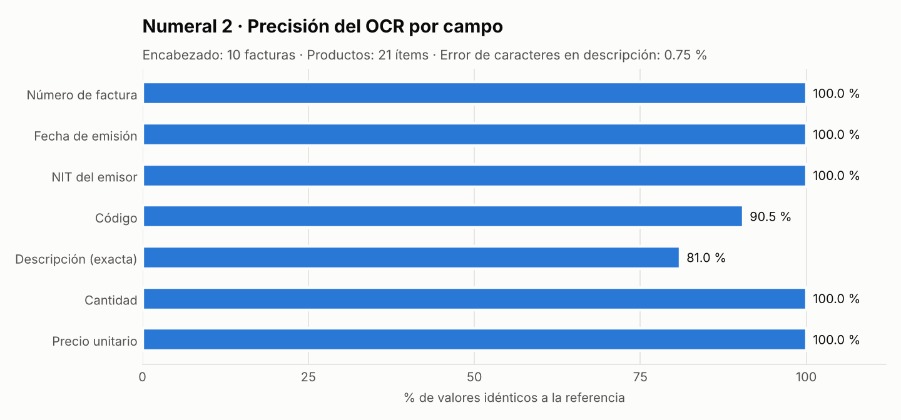

<div align="center">

# DIAN CUFE · RPA + OCR

**Descarga automática de facturas electrónicas desde el catálogo de la DIAN y extracción de sus datos a CSV**


-5C5C5C)


</div>

---

## Índice

1. [Resumen](#1-resumen)
2. [Cumplimiento del enunciado](#2-cumplimiento-del-enunciado)
3. [Inicio rápido](#3-inicio-rápido)
4. [Cómo funciona](#4-cómo-funciona)
5. [Resultados y tiempos](#5-resultados-y-tiempos)
6. [Restricciones métricas del proceso](#6-restricciones-métricas-del-proceso)
7. [Decisiones técnicas](#7-decisiones-técnicas)
8. [Salidas generadas](#8-salidas-generadas)
9. [Estructura del proyecto](#9-estructura-del-proyecto)
10. [Configuración](#10-configuración)
11. [Manejo de datos](#11-manejo-de-datos)
12. [Documentación técnica adicional](#12-documentación-técnica-adicional)

---

## 1. Resumen

| | Numeral 1 · RPA | Numeral 2 · OCR |
|---|---|---|
| **Qué hace** | Consulta cada CUFE en el catálogo de la DIAN, resuelve los dos captchas Cloudflare Turnstile y descarga el PDF de la representación gráfica | Exporta cada PDF a imágenes, extrae el texto por OCR, arma un DataFrame por factura y lo exporta a CSV |
| **Resultado** | **10/10** facturas descargadas, todas en el primer intento | **100 %** en número de factura, fecha y NIT del emisor; **100 %** en cantidad y precio unitario |
| **Tiempo por factura** | **9,80 s** en promedio | **9,25 s** en promedio |
| **Evidencia** | [`samples/pdfs/`](samples/pdfs/) · [video de la corrida](samples/video/rpa_demo.webm) | [`samples/csv/`](samples/csv/) · [`samples/metrics/`](samples/metrics/) |

> Todo corre dentro de Docker con un solo comando. El numeral 2 también se puede probar **sin conexión a la DIAN**, sobre los PDF de muestra incluidos en el repositorio.

---

## 2. Cumplimiento del enunciado

| Requisito | Cómo se cumple | Dónde |
|---|---|---|
| **1.** RPA que ingrese a la página de la DIAN | Navegador Chrome automatizado con Patchright sobre `catalogo-vpfe.dian.gov.co/User/SearchDocument` | [`src/rpa/dian_client.py`](src/rpa/dian_client.py) |
| **1.** Consultar los 10 CUFE | Lee `data/input.csv` y consulta cada CUFE con reintentos e idempotencia | [`data/input.csv`](data/input.csv) |
| **1.** Resolver el captcha | Resuelve **dos** Cloudflare Turnstile por factura (búsqueda y descarga) sin intervención humana ni servicios pagos | [`src/rpa/captcha.py`](src/rpa/captcha.py) |
| **1.** Descargar el PDF de la representación gráfica | Captura la descarga del botón "Descargar PDF" (no el certificado) y valida que sea un PDF íntegro | [`src/rpa/downloader.py`](src/rpa/downloader.py) |
| **2.** Extraer el texto de las imágenes exportadas | Cada página se exporta a PNG y el texto se extrae **solo por OCR** (Tesseract en español) | [`src/ocr/`](src/ocr/) |
| **2.** Un data frame por archivo | Un `pandas.DataFrame` por factura, con una fila por producto | [`src/ocr/pipeline.py`](src/ocr/pipeline.py) |
| **2.** Exportar a CSV | Un CSV por factura y un `consolidado.csv` | [`samples/csv/`](samples/csv/) |
| **2.** Número de factura, fecha de emisión, NIT del emisor | Extraídos de "Datos del Documento" y "Datos del Emisor / Vendedor" | [`src/ocr/header.py`](src/ocr/header.py) |
| **2.** Código, descripción, cantidad, precio unitario | Extraídos de "Detalles de Productos", celda por celda | [`src/ocr/table.py`](src/ocr/table.py) |
| **2.** Reportar tiempos empleados | Tiempo por etapa y por factura, medido en cada corrida | [Sección 5](#5-resultados-y-tiempos) |
| **2.** Reportar restricciones métricas | Límites del proceso cuantificados, con su impacto y mitigación | [Sección 6](#6-restricciones-métricas-del-proceso) |
| **Entrega:** código en Python y README | Este repositorio | — |

---

## 3. Inicio rápido

**Único requisito:** [Docker Desktop](https://www.docker.com/products/docker-desktop/) en ejecución.

```bash
git clone https://github.com/RugeAndrea/dian-cufe-rpa.git
cd dian-cufe-rpa
docker compose build
```

| Quiero… | Comando |
|---|---|
| Correr **todo** (numeral 1 + numeral 2) | `docker compose run --rm rpa python -m src.main all` |
| Solo el **numeral 1** (descargar los 10 PDF) | `docker compose run --rm rpa python -m src.main rpa` |
| Solo el **numeral 2**, sin conectarse a la DIAN | `docker compose run --rm rpa python -m src.main ocr --input-dir samples/pdfs` |
| Correr las **pruebas** | `docker compose run --rm rpa pytest -q` |

Los resultados quedan en la carpeta `output/` del proyecto.

<details>
<summary><b>Más opciones</b></summary>

```bash
# Un solo CUFE, forzando la descarga y grabando video de la sesión del navegador
docker compose run --rm rpa python -m src.main rpa --only 1 --force --record-video

# Solo las primeras N facturas
docker compose run --rm rpa python -m src.main rpa --limit 3

# OCR guardando imágenes de depuración (recorte de la tabla, máscara de la cuadrícula, columnas)
docker compose run --rm rpa python -m src.main ocr --debug
```

</details>

> **Mac con Apple Silicon (M1/M2/M3):** la imagen usa `platform: linux/amd64` porque Google Chrome solo se distribuye para amd64. Docker Desktop la ejecuta con emulación; funciona, pero más lento.

---

## 4. Cómo funciona



### Numeral 1 · RPA



1. **Captcha.** Turnstile se resuelve con un Chrome real, en modo visible dentro de una pantalla virtual (Xvfb). En modo *headless*, Cloudflare ni siquiera entrega el formulario.
2. **Búsqueda.** El campo NIT a veces aparece y a veces no, así que el robot lo llena solo cuando está visible.
3. **Segundo captcha.** La página de detalle tiene su propio Turnstile para la descarga. Se resuelve antes de abrir el modal de aviso, porque el modal bloquea los clics sobre el captcha.
4. **Descarga.** Se captura con `expect_download()` de Playwright y se verifica que el archivo empiece con `%PDF` y abra con el NIT.
5. **Robustez.** 3 reintentos con espera creciente y un navegador nuevo en cada uno. Las facturas ya descargadas se saltan (idempotencia). Hay una pausa de 2 a 4 s entre consultas para no saturar el servicio.
6. **Metadatos.** De la página de detalle se guardan serie, folio, fecha, emisor, receptor y total en `dian_detalle.json`, que sirve como referencia independiente para medir el OCR.

### Numeral 2 · OCR

1. **Exportar imágenes.** Cada PDF se abre con el NIT (PyMuPDF, cifrado AES) y cada página se exporta a PNG a 300 DPI.
2. **Encabezado.** Se hace OCR de la página y se extraen *Número de Factura*, *Fecha de Emisión* y *Nit del Emisor* con expresiones regulares. El NIT se toma solo de la sección del emisor, no de la del adquiriente.
3. **Tabla de productos.** Se ubica entre "Detalles de Productos" y la siguiente sección y se exporta una imagen solo de la tabla a 600 DPI. Las celdas se detectan con la cuadrícula (OpenCV) y cada una se lee por separado:
   - **Código:** solo mayúsculas, dígitos y `-./`.
   - **Cantidad y precio:** solo dígitos y separadores.
   - **Descripción:** texto libre en varias líneas. Las líneas se unen con un diccionario de frecuencias del español, porque la DIAN corta el texto por ancho, a veces a mitad de palabra.
4. **Normalización.** `$ 75.000,00` pasa a `75000.0`, `05/11/2024` pasa a `2024-11-05` y el NIT queda sin puntos ni dígito de verificación.
5. **Validación cruzada.** Σ(cantidad × precio unitario) se compara con el *Subtotal* de "Datos Totales". Si no cuadra, la fila se marca con `requiere_revision`.
6. **Exportación.** Un DataFrame por factura, su CSV y el consolidado.

> **Regla de diseño:** los datos se extraen **siempre de las imágenes**. La capa de texto del PDF se usa **solo** para medir la precisión del OCR, nunca para producir el dato entregado.

---

## 5. Resultados y tiempos

<!-- Gráficas y cifras generadas con: python scripts/make_charts.py -->

### 5.1 Numeral 1 · Tiempo del RPA

<picture>
  <source media="(prefers-color-scheme: dark)" srcset="docs/img/rpa_tiempos_dark.png">
  
</picture>

| Etapa (segundos) | Promedio | Mediana | Mínimo | Máximo | Total 10 facturas |
|---|---:|---:|---:|---:|---:|
| Navegación inicial, metadatos y captcha de descarga | 3,39 | 3,40 | 3,01 | 3,73 | 33,87 |
| Captcha de búsqueda | 2,32 | 2,33 | 2,14 | 2,51 | 23,25 |
| Búsqueda del CUFE | 0,94 | 0,90 | 0,87 | 1,14 | 9,42 |
| Descarga del PDF | 3,14 | 3,01 | 2,50 | 3,79 | 31,43 |
| **Total por factura** | **9,80** | **9,90** | **8,79** | **10,83** | **97,97** |

> El segundo Turnstile (de descarga) se resuelve **antes** de abrir el modal de descarga, no dentro de la etapa "Descarga del PDF" — por eso su tiempo queda dentro del primer renglón, junto con la navegación inicial y la lectura de metadatos, que tampoco se cronometran por separado.

Éxito: **10/10** en el primer intento · 0 reintentos · 20/20 captchas resueltos.

### 5.2 Numeral 2 · Tiempo del OCR

<picture>
  <source media="(prefers-color-scheme: dark)" srcset="docs/img/ocr_etapas_dark.png">
  
</picture>

| Etapa (segundos) | Promedio | Mediana | Mínimo | Máximo | Total 10 facturas |
|---|---:|---:|---:|---:|---:|
| PDF → PNG (300 DPI) | 0,38 | 0,38 | 0,28 | 0,42 | 3,76 |
| OCR del encabezado | 2,96 | 2,68 | 2,12 | 5,75 | 29,60 |
| Detección de la tabla (600 DPI) | 3,11 | 3,08 | 2,68 | 4,07 | 31,08 |
| OCR de la tabla por celdas | 1,91 | 1,19 | 0,77 | 4,89 | 19,10 |
| Normalización y exportación CSV | 0,90 | 0,85 | 0,80 | 1,10 | 9,01 |
| **Total por factura** | **9,25** | **8,45** | **7,05** | **13,51** | **92,55** |

RAM pico del proceso: **242,4 MB** en promedio (máximo 260,3 MB). Rendimiento: **6,48 facturas/minuto**.

> Ambos números subieron frente a la corrida anterior: `join_wrapped_lines` (sección 7) consulta `wordfreq` por cada línea de Código/Descripción, y esa consulta carga y mantiene en memoria el diccionario de frecuencias del español. Es el costo de medir la precisión real en vez de una que coincidía por una regla de unión compartida con la referencia.

### 5.3 Numeral 2 · Precisión del OCR

<picture>
  <source media="(prefers-color-scheme: dark)" srcset="docs/img/ocr_precision_dark.png">
  
</picture>

| Campo | Precisión | Referencia contra la que se mide |
|---|---:|---|
| Número de factura | 100 % (10/10) | HTML de la DIAN (`dian_detalle.json`) |
| Fecha de emisión | 100 % (10/10) | HTML de la DIAN |
| NIT del emisor | 100 % (10/10) | HTML de la DIAN |
| Código | 90,5 % (19/21) | Capa de texto del PDF |
| Descripción | 81,0 % exactas · 0,84 % de error de caracteres | Capa de texto del PDF |
| Cantidad | 100 % (21/21) | Capa de texto del PDF |
| Precio unitario | 100 % (21/21) | Capa de texto del PDF |
| Subtotal (validación cruzada) | 10/10 facturas cuadran | Σ(cantidad × precio) vs. "Datos Totales" |

**Cómo se mide:** el encabezado se compara contra el HTML de la página de detalle de la DIAN, que es una fuente independiente del PDF. Los productos se comparan contra la capa de texto del PDF. Los resultados por factura están en [`samples/metrics/ocr_validation.json`](samples/metrics/ocr_validation.json).

### 5.4 Proyección a escala

| | Por factura | 1.000 facturas |
|---|---:|---:|
| RPA | 9,80 s | 2,7 h |
| OCR | 9,25 s | 2,6 h |
| **Proceso completo (secuencial)** | **19,05 s** | **≈ 5,3 h** |

---

## 6. Restricciones métricas del proceso

| Restricción | Métrica observada | Impacto | Mitigación / mejora posible |
|---|---|---|---|
| **Captcha Cloudflare Turnstile** | Visible + Xvfb: 5/5 resueltos (~5,8 s en la prueba aislada). *Headless*: 0/1 | Obliga a correr un navegador visible; impide el modo *headless*, más liviano | Xvfb dentro de Docker. La interfaz `CaptchaSolver` permite agregar un servicio de tokens si Cloudflare endurece el reto |
| **Dos captchas por factura** | Captcha de búsqueda: 2,32 s en promedio, cronometrado aparte; el de descarga se resuelve antes de abrir el modal y no tiene cronómetro propio — su tiempo queda dentro de "navegación, metadatos y captcha de descarga" (3,39 s) | Son la mayor parte del tiempo variable del RPA | Resolver el segundo apenas carga la página de detalle, mientras se leen los metadatos (ya se hace así); instrumentar su tiempo por separado |
| **Navegación, metadatos y captcha de descarga sin cronómetro propio** | 3,39 s por factura (35 % del RPA) | Es el mayor bloque del RPA, pero agrupa tres cosas que hoy no se miden por separado | Cronometrar el captcha de descarga aparte; reutilizar un mismo navegador para varios CUFE |
| **Procesamiento secuencial** | 16,59 s por factura → ≈ 4,6 h por 1.000 | Paralelizar contra la DIAN arriesga bloqueos por volumen | El OCR sí se puede paralelizar (es local); el RPA debe seguir controlado |
| **NIT obligatorio** | 10/10 facturas lo requieren como contraseña del PDF | Sin NIT no se puede abrir el documento | El NIT viaja con cada CUFE en `input.csv` |
| **Dependencia del sitio de la DIAN** | Selectores y URLs centralizados en un solo archivo | Un cambio del HTML rompe el RPA | `src/rpa/config.py` + errores explícitos en el log y en las métricas |
| **Errores de un carácter de Tesseract** | Código: 2 de 21 (`S`↔`5`, una `S` de más). Descripción: 1 de 21 con un espacio de más (Tesseract funde "TE"+"A" en "TEA" **dentro** de una misma línea, antes de que `join_wrapped_lines` vea los fragmentos; "TEA" y "DIFEREN" pasan el umbral de frecuencia, así que la regla decide que son dos palabras) | No bajan la confianza ni alteran el subtotal, así que no se detectan automáticamente | Lista blanca de caracteres (subió el código de 73 % a 90,5 %). El caso de descripción se documenta como límite conocido de `join_wrapped_lines`, sin reglas por factura ([`docs/ocr_tabla.md`](docs/ocr_tabla.md)) |
| **Cortes de línea de la DIAN** | La DIAN corta las descripciones por ancho y elimina el espacio en el corte | Riesgo de pegar o partir palabras | Unión con un diccionario de frecuencias del español ([`docs/ocr_tabla.md`](docs/ocr_tabla.md)) |
| **Costo del OCR de la tabla a 600 DPI** | Detección 2,35 s + OCR 1,46 s por factura | Es el 56 % del tiempo del OCR | Se mantiene: la letra de la tabla es pequeña y la nitidez a 600 DPI es parte de lo que llevó la descripción a menos de 1 % de error |
| **Tamaño de la muestra** | 10 facturas, 21 ítems | Los umbrales se calibraron con pocos datos | Recalibrar con un lote mayor antes de producción |

---

## 7. Decisiones técnicas

<details>
<summary><b>¿Por qué Patchright con un Chrome visible y no Selenium o el modo headless?</b></summary>

Antes de construir el RPA se hizo una prueba aislada del captcha ([`docs/spike_turnstile.md`](docs/spike_turnstile.md)): Patchright (Playwright con anti-detección) con Chrome visible dentro de Xvfb resolvió **5 de 5** captchas, y el modo *headless* **0 de 1**, porque Cloudflare no entrega el formulario. Docker con Xvfb permite el modo visible en cualquier máquina sin pantalla.
</details>

<details>
<summary><b>¿Por qué no se usó un servicio pago para resolver el captcha?</b></summary>

No fue necesario: la estrategia con navegador resolvió el 100 % de los captchas. Agregar un servicio externo implicaba una clave de API, costos y código que no se podía probar. La interfaz `CaptchaSolver` deja la puerta abierta para incorporarlo.
</details>

<details>
<summary><b>¿Por qué OCR si el PDF trae texto?</b></summary>

El enunciado pide extraer el texto **de las imágenes exportadas**. La capa de texto se aprovecha de otra forma: como referencia para **medir** el OCR con datos y no a ojo.
</details>

<details>
<summary><b>¿Por qué la tabla se lee celda por celda?</b></summary>

El primer enfoque (OCR de todo el cuerpo y asignar cada palabra a una columna) mezclaba columnas, perdía un producto y producía texto basura. Leer cada celda de la cuadrícula a 600 DPI eliminó esos problemas: la descripción pasó de 25 % a menos de 1 % de error de caracteres, y cantidad y precio llegaron al 100 %. La comparación completa está en [`docs/ocr_tabla.md`](docs/ocr_tabla.md).
</details>

<details>
<summary><b>¿Por qué se guarda el PDF cifrado?</b></summary>

Se conserva exactamente como lo entrega la DIAN, por trazabilidad. Solo se abre con el NIT para validarlo y para el OCR. Se usa PyMuPDF porque soporta AES de forma nativa.
</details>

---

## 8. Salidas generadas

| Ruta | Contenido |
|---|---|
| `output/pdfs/{n}_{cufe}.pdf` | Representación gráfica tal como la entrega la DIAN |
| `output/images/{n}_{cufe}_p{k}.png` | Cada página a 300 DPI (imágenes exportadas) |
| `output/images/{n}_{cufe}_tabla_p{k}.png` | Recorte de la tabla de productos a 600 DPI |
| `output/csv/{n}_{numero_factura}.csv` | DataFrame de cada factura |
| `output/csv/consolidado.csv` | Las 10 facturas en un solo archivo |
| `output/metadata/dian_detalle.json` | Datos de la página de detalle de la DIAN (referencia) |
| `output/metrics/rpa_metrics.json` | Tiempos y estado del RPA por CUFE |
| `output/metrics/ocr_metrics.json` | Tiempos por etapa, RAM y confianza del OCR |
| `output/metrics/ocr_validation.json` | Precisión del OCR por factura y campo |
| `output/logs/rpa.log` | Log de la ejecución |

**Columnas del CSV:**

| Columna | Ejemplo | Descripción |
|---|---|---|
| `archivo` | `01_eccc372e4bdb.pdf` | PDF de origen |
| `cufe` | `eccc372e…60f1` | CUFE consultado |
| `numero_factura` | `FEBQ-243564` | Número de factura |
| `fecha_emision` | `2024-11-05` | Fecha de emisión (ISO 8601) |
| `nit_emisor` | `800033723` | NIT del emisor, sin dígito de verificación |
| `codigo` | `882262` | Código del producto |
| `descripcion` | `ECOGRAFIA DOPPLER DE ARTERIAS ILIACAS` | Descripción del producto |
| `cantidad` | `1.0` | Cantidad |
| `precio_unitario` | `75000.0` | Precio unitario en pesos |
| `cuadre_subtotal` | `True` | Σ(cantidad × precio) coincide con el Subtotal |
| `requiere_revision` | `False` | Fila marcada para revisión manual |

Los CSV usan codificación UTF-8 con BOM, para que Excel en español muestre bien las tildes.

---

## 9. Estructura del proyecto

```
dian-cufe-rpa/
├── src/
│   ├── main.py              # CLI: rpa | ocr | all
│   ├── rpa/                 # Numeral 1
│   │   ├── config.py        #   URLs, selectores y tiempos (centralizados)
│   │   ├── captcha.py       #   Interfaz CaptchaSolver + Turnstile
│   │   ├── dian_client.py   #   Flujo búsqueda → detalle → descarga
│   │   ├── downloader.py    #   Captura y validación del PDF
│   │   └── metadata.py      #   Datos de la página de detalle
│   ├── ocr/                 # Numeral 2
│   │   ├── exporter.py      #   PDF → PNG
│   │   ├── engine.py        #   Tesseract
│   │   ├── header.py        #   Encabezado
│   │   ├── table.py         #   Tabla por celdas
│   │   ├── normalize.py     #   Dinero, fechas, NIT
│   │   ├── validate.py      #   Precisión contra las referencias
│   │   └── pipeline.py      #   Orquestación, DataFrames, CSV, métricas
│   └── common/              # Logging y cronómetro de etapas
├── data/input.csv           # CUFE + NIT
├── samples/                 # Corrida real: PDF, imágenes, CSV, métricas y video
├── docs/                    # Evidencia técnica y gráficas
├── scripts/make_charts.py   # Genera las gráficas de este README
├── tests/                   # Pruebas con pytest
├── Dockerfile
└── docker-compose.yml
```

---

## 10. Configuración

- **Agregar facturas:** añadir filas a [`data/input.csv`](data/input.csv) con las columnas `n,cufe,nit`.
- **Ajustar parámetros:** copiar [`.env.example`](.env.example) a `.env`. Se pueden cambiar tiempos de espera, reintentos, pausas, DPI y rutas. Todos los valores son opcionales y tienen un valor por defecto.
- **Regenerar las gráficas:** `docker compose run --rm rpa python scripts/make_charts.py --metrics output/metrics`.

---

## 11. Manejo de datos

- Los datos procesados provienen exclusivamente de los CUFE entregados por la empresa en la prueba técnica, que los declara ficticios y de uso evaluativo.
- La carpeta [`samples/`](samples/) se versiona **solo** para que la evaluación sea reproducible sin depender de la DIAN.
- En una operación real, `output/` nunca se versiona (está en `.gitignore`), los PDF permanecen cifrados con su NIT y los datos personales se tratarían conforme a la **Ley 1581 de 2012** de protección de datos personales.

---

## 12. Documentación técnica adicional

- [`docs/spike_turnstile.md`](docs/spike_turnstile.md): prueba aislada del captcha, comparación entre modo visible y *headless*, y el hallazgo del segundo Turnstile.
- [`docs/ocr_tabla.md`](docs/ocr_tabla.md): diseño del OCR de la tabla, comparación antes y después, regla de unión de líneas y limitaciones.

---

<div align="center">

Desarrollado por **Andrea Ruge** · [github.com/RugeAndrea](https://github.com/RugeAndrea)

</div>
